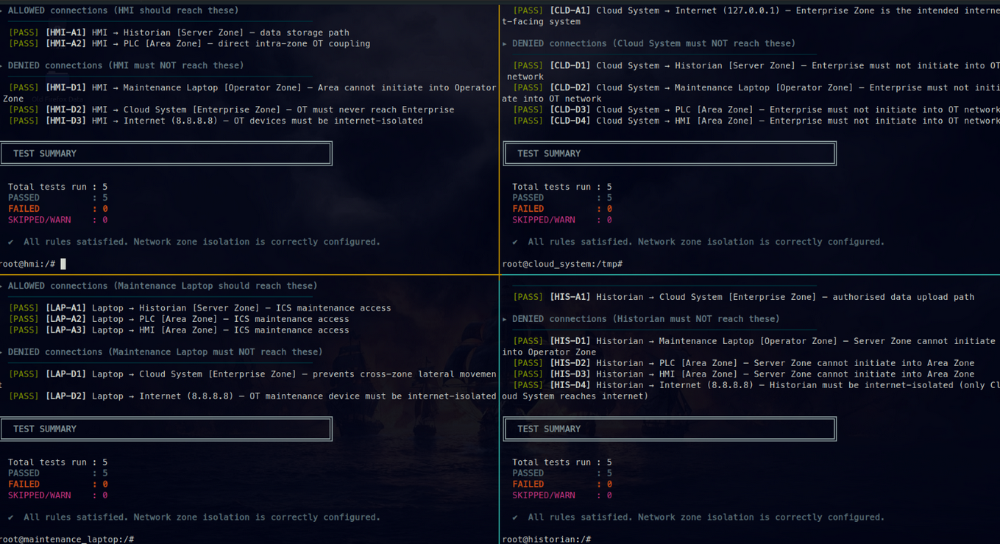

This is part of a network security and segmentation assignment at my university. I implemented a segmented network and used Claude to test if the zones were correctly configured.

The prompt used to generate the script (zone_connectivity_test.sh) was as follows.

```
I have 4 subnets: 10.0.0.0/24 (Area Zone) 10.10.0.0/24 (Operator Zone) 10.20.0.0/24 (Server Zone) 10.30.0.0/24 (Enterprise Zone)

The IPs are assigned as follows:
PLC: 10.0.0.10
HMI: 10.0.0.11
Laptop 10.10.0.10
HISTORIAN: 10.20.0.10
Cloud System: 10.30.0.10


The rules are as follows:

Enterprise Zone contains the Cloud System which communicates with the internet. Therefore, I disabled inbound traffic that originates from the Enterprise Zone. Only the Historian can initiate communication to send data to the Cloud System. 
Operator Zone contains the maintenance laptop. I decided that the maintenance laptop needs to have access to both the Historian, the PLC, and the HMI for ICS maintenance operations. The Operator Zone can initiate communication with both the Server Zone and the Area Zone. However, no zone can initiate communication directed at the Operator Zone. This design prevents lateral movement in case the Historian, the PLC, or the HMI gets compromised. Even though we view compromise of the OT network as the worst-case scenario, there’s a lot more risk involved if an attacker could compromise the OT network first and then move across the zones into the Enterprise Zone as well. 
Server Zone contains the Historian. It can receive communication from the Operator Zone and the Area Zone for maintenance and data storage reasons, but it cannot initiate communication to the 2 zones. 
The Area Zone contains the HMI and the PLC. I put them in the same zone since they are designed to be directly connected to each other. The Area Zone can only initiate communication to the Server Zone for data storage reasons and can only receive communication from the Operator Zone for maintenance purposes. 
In this design, it’s important that the maintenance laptop, the Historian, the PLC, and the HMI are disconnected from the internet. 

Can you write me a bash script that runs connection tests based on aforementioned rules. I should be able to run this script on each machine (PLC, HMI, maintenance laptop, cloud system, historian) and get a readable report of whether or not each requirement is fulfilled down to the T.
```

This is the output of the tool after I ran it on 4 different machines

